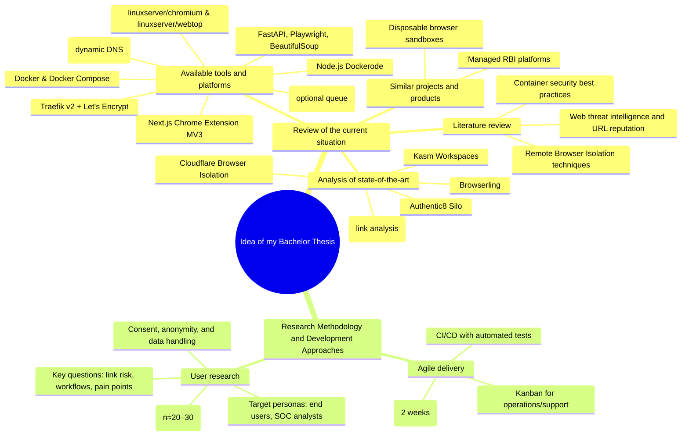

# Mind Map — Bachelor Thesis Concept

Render this diagram with Mermaid-compatible viewers (e.g., VS Code Mermaid preview or GitHub).

```mermaid
mindmap
  root((Idea of my Bachelor Thesis))
    Review of the current situation
      Available tools and platforms
        Docker & Docker Compose
        Traefik v2 + Let's Encrypt
        DuckDNS (dynamic DNS)
        linuxserver/chromium & linuxserver/webtop
        FastAPI, Playwright, BeautifulSoup
        Node.js Dockerode
        Next.js Chrome Extension MV3
        MongoDB Redis (optional queue)
      Literature review
        Remote Browser Isolation techniques
        Container security best practices
        Web threat intelligence and URL reputation
      Analysis of state-of-the-art
        Cloudflare Browser Isolation
        Authentic8 Silo
        Kasm Workspaces
        Browserling
        URLScan.io & VirusTotal (link analysis)
      Similar projects and products
        Disposable browser sandboxes
        Managed RBI platforms
    Research Methodology and Development Approaches
      Agile delivery
        Scrum sprints (2 weeks)
        Kanban for operations/support
        CI/CD with automated tests
      User research
        Target personas: end users, SOC analysts
        Survey + interviews (n≈20–30)
        Key questions: link risk, workflows, pain points
        Consent, anonymity, and data handling
```
